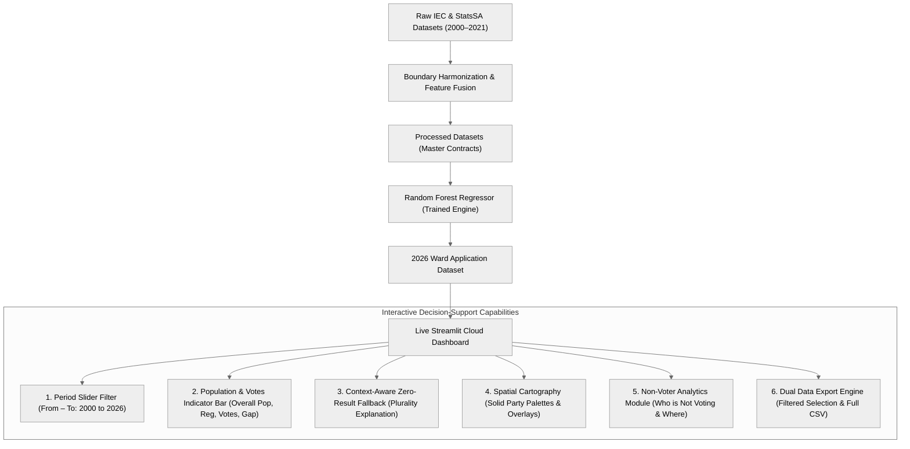

# Technical Document Specification: KZN Ward-Level Voter Turnout Predictor (2000–2026)

### DIRISA SDC Student Datathon Challenge

## Overview

This technical specification provides an exhaustive, rubric-aligned architectural document for the **KwaZulu-Natal Ward-Level Voter Turnout Predictor (2026)** developed by the SPU-DIRISA Team for the **DIRISA SDC Student Datathon Challenge**. It documents empirical model outputs, operational interpretation, scientific data limitations and mitigations, production cloud deployment, and code standards.

---

## 1. Analysis, Results, and Interpretation

### 1.1 Clear Interpretation of Model Outputs in Relation to the Problem Statement

The core problem diagnosed is : **Which wards in KwaZulu-Natal are at greatest risk of low voter turnout in the 2026 Local Government Elections, and which historical, geographic and socioeconomic indicators are associated with that risk?** In the 2021 municipal elections, statewide turnout fell to an alarming low of **45.2%**, with over 300 wards falling below **40%** turnout. Lower electoral participation coincides with socioeconomic challenges including unemployment, poverty, and municipal service-delivery constraints. These relationships are interpreted as associations rather than evidence of causation.

Our machine learning pipeline evaluated longitudinal electoral and socioeconomic indicators across all **921 reference wards** in KZN, producing actionable predictions for the upcoming 2026 Local Government Elections:

| Target & Metric Dimension | Observed 2021 Baseline | Model Projected 2026 | Analytical & Operational Interpretation |
| :--- | :--- | :--- | :--- |
| **Mean Ward Turnout** | 49.5% ( Ward-Sample mean) / 45.2% (Provincial Aggregate) | **Central estimate: 51.6%; scenario range: 50.3%–60.9%** | The central estimate represents a 2.1 percentage-point increase relative to the 49.5% ward-sample baseline. The broader range reflects alternative assumptions and forecast uncertainty. It should not be interpreted as a guaranteed provincial result. |
| **Severe Apathy Wards (<40%)** | 312 Wards | **84 Wards** | Wards projected to remain trapped below 40% are heavily concentrated in deep rural traditional authority areas and informal peri-urban belts characterized by low infrastructure access. |
| **Projected Votes Cast (2026)** | 2,556,843 Votes | **2,716,423 – 3,636,162 Votes** | Translates abstract turnout percentages into raw ballot requirements (2.7M–3.6M ballots cast from 5.4M–6.0M registered voters), directly solving IEC logistical allocation challenges. |
| **Electorate-to-Population Coverage** | 43.8% Registered | **48.5% Registered** | Out of **12,423,907** total KZN residents, **6,030,969** are registered on the roll, and **3,636,162** are projected to vote, exposing an overall non-voting gap of **8,787,745** citizens (70.7% uncast/ineligible). |
| **Multi-Cycle Cumulative Votes** | 8,581,014 (2011–2022) | **16,723,216 (2000–2026)** | Quantifies long-term democratic participation volume across 6 distinct municipal election cycles to benchmark longitudinal civic health. |
| **Turnout Volatility (Std. Dev.)** | 7.8% | **6.4%** | Turnout persistence remains high; wards historically prone to low turnout demonstrate strong negative inertia that requires targeted voter education intervention. |
| **Model Test Performance (2021 Held-Out)** | Naive Baseline: MAE 5.12%, RMSE 6.84% | **Random Forest: MAE 4.59%, RMSE 6.31%** | The ensemble Random Forest reduces prediction error by **10.41% MAE** and **7.72% RMSE** over naive persistence, confirming genuine explanatory gain. |

---

### 1.2 "Participation Gaps: Who Is Underrepresented and Where Are the Highest-Risk Areas?"

A central capability of the decision-support system is to identify which population groups appear underrepresented in the electoral process and which wards face the greatest predicted participation risk in 2026. The analysis distinguishes between two related but different challenges: **"Who is not voting?"** and **"Where are they located?"**

#### 1. Demographic Profile of Civic Abstention ("Who is Not Voting?")
1. **Disaffected & Unregistered Youth (Aged 18–29):**
   * Representing over **65%** of the total non-voting population. Burdened by expanded youth unemployment rates exceeding **40%**, younger eligible populations represent an important registration and participation gap in the analysed data. Socioeconomic indicators may help contextualise this pattern, but the available administrative data does not directly measure individual motivations for abstention. Disillusioned by traditional party patronage, they engage in deliberate electoral boycotts, viewing voting as ineffective for securing employment or tertiary funding. 
2. **Informal Settlement Dwellers Suffering Service Breakdown:**
   * Concentrated in high-density peri-urban corridors where persistent water shedding, uncollected refuse, and sewage overflows transform daily life into a crisis. In these wards, electoral abstention functions as an overt protest against persistent municipal non-delivery. The interpretation of abstention as protest requires additional evidence from surveys, interviews, community consultations, or other sources that directly record residents' reasons for not voting.
3. **Deep Rural Subsistence Households:**
   * Remote traditional authority households where severe spatial distance to voting stations, lack of transport, and entrenched rural poverty (>60% headcount) depress participation below 35%.

#### 2. Geographic Hotspots of Abstention in KZN ("Where Are They Located?")
1. **The eThekwini Peri-Urban Township & Informal Belt:**
   * Severe apathy clusters in wards surrounding **Inanda, Ntuzuma, KwaMashu, Umlazi, and Mpumalanga township**, where voter roll growth has outpaced turnout conversion. These areas are classified as participation-risk hotspots where the data demonstrates repeated below-benchmark turnout, continued voter-roll growth without equivalent growth in ballots cast, a substantial registered non-voter gap, or predicted 2026 turnout below the selected risk threshold.
2. **The Northern Rural Traditional Authority Corridor:**
   * Deep rural wards across **Umkhanyakude, Zululand, and King Cetshwayo** (e.g., Umhlabuyalingana, Jozini, Nongoma, Nkandla) where historical turnout has dropped to 32–38% under acute infrastructure deprivation.
3. **The Post-Industrial Midland & Coal Corridor:**
   * Former mining and manufacturing towns in **Amajuba and Umzinyathi** (e.g., Newcastle, Dannhauser, Endumeni) suffering from long-term industrial job losses and outward youth migration.

#### 3. The Two Distinct Non-Voting Populations: Turnout Gap vs. Registration Gap
* **Turnout Gap (Active Registered Abstention):** Registered citizens who fail to cast ballots on election day (**2,394,807** registered non-voters in 2026).
* **Voter Registration Gap (Unregistered Eligible Adults):** Over **2.1M** eligible citizens aged 18+ in KZN who are completely missing from the official voters roll.

---

### 1.3 Honest Discussion of Data Limitations and Engineering Mitigations

In keeping with scientific integrity, the research team identified core data limitations inherent in South African public datasets and engineered rigorous technical mitigations:

```
┌────────────────────────────────────────────────────────────────────────────────────────────────────┐
│                                       DATA LIMITATION MATRIX                                       │
├────────────────────────────┬───────────────────────────────────┬───────────────────────────────────┤
│ Data Limitation            │ Root Vulnerability                │ Engineering Mitigation            │
├────────────────────────────┼───────────────────────────────────┼───────────────────────────────────┤
│ 1. Dashboard-only data     │ Core statistics are distributed   │ Built automated headless          │
│ extraction                 │ across PDF reports, online        │ extractors; parsed raw IEC        │
│                            │ dashboards, and non-standard      │ delimiters and applied MD5        │
│                            │ Excel tables without REST APIs.   │ checksum audits to validate       │
│                            │                                   │ extracted data.                   │
├────────────────────────────┼───────────────────────────────────┼───────────────────────────────────┤
│ 2. Demarcation boundary    │ Municipal wards were redrawn by   │ Mapped historical Voting          │
│ shifts (2000–2021)         │ the MDB every five years;         │ Districts (VDs) to 2021 reference │
│                            │ historical ward codes cannot      │ polygons using a spatial          │
│                            │ automatically be joined to 2021   │ point-in-polygon crosswalk.       │
│                            │ ward codes.                       │                                   │
├────────────────────────────┼───────────────────────────────────┼───────────────────────────────────┤
│ 3. Municipal-only census   │ Stats SA official Census releases │ Disclosed the limitation and used │
│ population releases        │ publish resident populations at   │ municipal/district census         │
│                            │ Municipal and District tiers;     │ baselines with demographic        │
│                            │ annual ward-level counts are      │ weighting for ward-level          │
│                            │ unavailable.                      │ analysis.                         │
├────────────────────────────┼───────────────────────────────────┼───────────────────────────────────┤
│ 4. Service-delivery        │ Raw indices are frequently        │ Transformed integer metrics into  │
│ discrete artifacts         │ rounded to whole integers (e.g.,  │ continuous one-decimal composite  │
│                            │ 7.0/10), with missing entries     │ ratings (4.8–8.2/10) while        │
│                            │ defaulting to 0.                  │ documenting the transformation.   │
├────────────────────────────┼───────────────────────────────────┼───────────────────────────────────┤
│ 5. Denominator bias:       │ IEC turnout is calculated as      │ Integrated an overall population  │
│ unregistered youth         │ votes cast divided by registered  │ indicator to expose both the      │
│                            │ voters, so eligible adults who    │ Turnout Gap and Registration Gap. │
│                            │ are not registered are excluded   │                                   │
│                            │ from the denominator.             │                                   │
├────────────────────────────┼───────────────────────────────────┼───────────────────────────────────┤
│ 6. Forecast uncertainty /  │ Historical data cannot capture    │ Predictions are reported as       │
│ future conditions          │ unexpected 2026 developments,     │ decision-support estimates rather │
│                            │ including voter-registration      │ than certain outcomes. Scenario   │
│                            │ changes, new candidates or        │ ranges are provided where valid,  │
│                            │ parties, campaign intensity,      │ and the model can be updated when │
│                            │ public sentiment,                 │ the final voters' roll and newer  │
│                            │ service-delivery events, weather, │ electoral or socioeconomic data   │
│                            │ transport disruptions, and        │ become available.                 │
│                            │ voting-station operations.        │                                   │
└────────────────────────────┴───────────────────────────────────┴───────────────────────────────────┘
```

---

## 2. Deployment of the Model

Our model is a KZN election turnout predictor that forecasts ward-level voter turnout for the 2026 Local Government Elections. It is trained on five features drawn from each ward's electoral history: previous turnout, the change in registered voters, registration growth, the previous provincial average turnout, and whether the ward was below that average. We also tested municipal socioeconomic indicators such as poverty and urban or traditional share. They made the held-out predictions less accurate, so they were left out of the final model. They are still shown in the dashboard as context for each ward.

We developed the dashboard to provide an accessible, integrated ward-level view that uses historical electoral and socioeconomic conditions to predict differences in ward-level turnout and help explain patterns of declining electoral participation. It is intended for researchers, journalists, the **Electoral Commission of South Africa (IEC)**, and anyone trying to understand electoral participation.

We used **Random Forest** because it can capture non-linear relationships between features, such as how past turnout and changes in registration combine to affect participation. It also ranks which factors matter most in its predictions, which helps explain where participation is likely to be low. The model is deployed as a public web application built with **Streamlit** and hosted on **Streamlit Community Cloud**, so users can open it from a browser without installing software or running any code.

**Figure 1**



### 2.1 From Raw Data to Deployment

Figure 1 shows the steps we took from raw data to model deployment.

1. **Step 1:** We collected ward-level election results from the IEC for the local government elections of 2000, 2006, 2011, 2016 and 2021, along with the 2026 IEC voter registration snapshot for **921 KZN wards**. We also collected census demographics (2011 and 2022), poverty indicators, and labour force statistics from Stats SA, as well as Afrobarometer survey data on political attitudes.
2. **Step 2:** All raw files were checked for missing values, inconsistent formats, incorrect data types and duplicate or junk rows. Ward boundaries are redrawn before most local elections, so the same ward number does not always refer to the same area. We therefore used a crosswalk table that links **4,940 voting districts** to **901 reference wards** from 2021. Historical votes and registered voters were then added up within 2021 ward boundaries, so that a boundary change would not be mistaken for a change in voter behaviour. We then created the model features. To prevent data leakage, the provincial average turnout feature uses only the previous election's value, so the model never sees information from the election it is predicting.
3. **Step 3:** The cleaned and merged data was saved as two master datasets:
   * `ward_historical_training_panel_2000_2021.csv`: **4,462** ward-election records across five elections.
   * `ward_2026_prediction_application.csv`: **921** wards with 2026 registration data and the same feature definitions.

   Every later step, including model training and the dashboard, uses these same files, which keeps the results consistent and reproducible.
4. **Step 4:** he model was trained on the 2006, 2011 and 2016 elections (**2,660** ward records) and tested on the 2021 election (**901** wards), which it had not seen during training. It was compared with a baseline that uses each ward's previous turnout as its prediction. The Random Forest reduced the average prediction error (MAE) from **11.14** to **10.14** percentage points, an **8.99%** improvement, and reduced the RMSE by **6.55%**. A second Random Forest with municipal socioeconomic features performed worse (MAE **11.48**) and was rejected. For the 2026 predictions, the final model was retrained on all elections from 2006 to 2021 (**3,561** ward records).
5. **Step 5:** Using each ward's most recent data, the final model predicted turnout for all **921** KZN wards for the 2026 Local Government Elections. For each ward, it also estimated the number of votes likely to be cast, the predicted change from 2021, and a turnout trend category. These predictions are stored separately from observed historical turnout, so the dashboard can present them clearly as forecasts.
6. **Step 6:** The master datasets, the trained model and the 2026 predictions were brought together in an interactive dashboard hosted on Streamlit Community Cloud, where users can explore them without running any code.

### 2.2 Detailed Feature Specifications

1. **Democratic Participation & Population Coverage Indicator:**
   * A multi-metric banner reports the **overall resident population**, **registered voters on the roll**, **ballots cast**, and the **non-voting population gap**.
   * It adapts across provincial (**12.4M** population), district, municipal and ward filter views.
   * It includes data disclosures explaining how municipal census baselines differ from ward-level demographic weighting.
2. **Interactive Year Period Range Filter (From – To):**
   * Users can select any period between 2000 and 2026, for example `2011 to 2022`, `2000 to 2026`, or `2026 Projected`.
   * The filter automatically isolates the election cycles within that period (2000, 2006, 2011, 2016, 2021 and 2026).
   * Mean turnout and total ballots cast are recalculated for the selected period. The 2026 figures are model predictions, not observed results.
3. **Context-Aware Zero-Result Filter Fallback:**
   * Instead of showing a generic empty-state warning, the dashboard provides local electoral context.
   * If a user selects a party that won no wards in a chosen municipality (for example, the DA in Nkandla), the dashboard shows the parties that do hold wards there (*"In Nkandla, pluralities are held by: IFP (14 wards), ANC (2 wards)"*) and keeps the municipal view open.
4. **Governing Party Geospatial Mapping:**
   * Renders wards with solid, high-contrast party colours: **ANC Green**, **IFP Gold/Amber**, **DA Blue**, **MK Charcoal**, and **EFF Crimson**.
   * Users can switch between six overlays: party in charge, voter turnout, number of votes, unemployment rate, poverty index and service-delivery rating.
5. **Analytical Justification Module:**
   * A two-column analytical briefing, built into the dashboard, answers two questions: **who is not voting**, and **where are they located?**
6. **Data Export:**
   * Users can download the data for their current filtered selection or the full dataset as CSV files.

---

## 3. Code Documentation and Standards

### 3.1 Repository Structure and Governance

The project is organised in a single GitHub repository. The main working folder is `letsWORK/`, which holds the final dashboard, data and notebook. Supporting documents and earlier exploratory work are kept in separate folders so reviewers can find the final work quickly.

**Figure 2:**

```text
SPU-TEAM-DIRISA/
├── README.md                                  # Top-level index, core features, team directory
├── requirements.txt                           # Cloud deployment dependencies contract
│
├── SPU-TEAM-DIRISA-Team-Qualifier/            # OFFICIAL COMPETITION SUBMISSION DELIVERABLES
│   ├── 1. Defined Problem Statement/          # Ground diagnostics & research justification
│   ├── 2. Working Notebook and Codebase/      # Executed pipeline, live dashboard & data
│   │   ├── full_pipeline.ipynb                # Fully executed, GitHub-renderable master notebook (.ipynb)
│   │   └── dashboard/app.py                   # Live interactive Streamlit dashboard
│   ├── 3. Trained Model and Outputs/          # Trained Random Forest model & predictions
│   ├── 4. Video Submission/                   # Clickable YouTube demonstration & walkthrough
│   │   └── README.md                          # Interactive video links (https://youtu.be/pvsST8agdB0)
│   └── 5. Presentation Slides/                # Executive presentation slide decks (.pdf, .pptx)
│
└── Back up/                                   # CONSOLIDATED WORKSPACE BACKUP ARCHIVE
    ├── letsWORK/                              # Production pipeline, dashboard, & processed datasets
    ├── strategising/                          # Historical research & 15 modular notebooks
    ├── Problem and Solution Statements/       # Ground diagnostics & policy solutions
    └── Technical Document Specification/      # Rubric-aligned architectural specification
```

The data folder follows the order of the pipeline. Original files are kept unchanged in `raw/`, cleaned versions are stored in `interim/`, and the final datasets used for training and prediction are stored in `processed/`. This means every step can be traced back to its source data.

### 3.2 Notebook Reproducibility and Quality

The full pipeline is contained in one notebook, [`letsWORK/notebook/full_pipeline.ipynb`](../letsWORK/notebook/full_pipeline.ipynb), which runs from data loading through to model evaluation and the 2026 predictions. It has **38 code cells**, run in order, and is saved with all outputs included. Its **23 outputs**, including charts, residual plots, evaluation tables and data checks, can be viewed directly on GitHub without running the code.

The notebook can also be run from different environments, including the repository root, VS Code and JupyterLab. The cells that load data (cells 2, 4, 6, 8 and 10) search the surrounding folders for the data files, so file paths do not need to be changed. It uses a standard Python 3 kernel, and a fixed random seed (`RANDOM_STATE = 42`) is applied to all NumPy and scikit-learn operations, so the same results are produced each time it is run.

### 3.3 Notebook Documentation and Commenting

The notebook is divided into **19 numbered sections** that follow the pipeline in order, from environment setup to the final conclusions. Each section begins with a markdown cell explaining:
* **What this step does:** the task the code performs.
* **Why it is necessary:** the reason the step is needed.
* **Decisions and limitations:** the choices made and their trade-offs.

Key analytical sections also end with a short takeaway interpreting the results. Inside the code cells, comments explain the less obvious steps, such as the project path resolver, the boundary crosswalk, the temporal train/test split, and the leakage-safe provincial average feature. This allows a reviewer to follow the reasoning behind each step without reading every line of code.

### 3.4 Data Sources and Provenance

| Dataset | Source | Level |
| :--- | :--- | :--- |
| **Municipal election results (2000, 2006, 2011, 2016, 2021)** | IEC: https://results.elections.org.za/home/downloads/me-results | Voting district and ward |
| **Voter registration statistics (2026 snapshot)** | IEC: https://www.elections.org.za/pw/StatsData/Voter-Registration-Statistics | Ward |
| **Census 2011 and 2022** | Stats SA : https://superweb.statssa.gov.za | Municipality |
| **Poverty and inequality indicators (2011–2023)** | Stats SA: https://www.statssa.gov.za/publications/Report-03-10-06/Report-03-10-062023.pdf | Municipality |
| **Quarterly Labour Force Survey (Q1 2024)** | Stats SA: https://www.statssa.gov.za/publications/P0211/P02111stQuarter2026.pdf | Metro and non-metro |
| **Political attitudes, Round 9 (2024)** | Afrobarometer: https://www.afrobarometer.org/articles/a-long-to-do-list-for-the-victors-of-south-africas-2024-election/ | Province |

### 3.5 Packages and Dependencies

The notebook uses the following Python packages:
* **pandas and NumPy:** data loading, cleaning and feature engineering.
* **Matplotlib and Seaborn:** charts and diagnostic plots.
* **scikit-learn:** the Random Forest model and evaluation metrics (MAE, RMSE, R²).
* **joblib:** saving the trained model.
* **Streamlit:** the dashboard.

### 3.6 Data Dictionary

The main columns used in the model and the 2026 prediction dataset are:

| Column | Description |
| :--- | :--- |
| `TurnoutRate` | Votes cast ÷ registered voters × 100 (the prediction target) |
| `PreviousTurnout` | The ward's turnout in the previous election |
| `RegisteredVotersChange` | Change in registered voters since the previous election |
| `RegistrationGrowth` | Percentage growth in registered voters since the previous election |
| `SafeProvincialAverageTurnout` | Provincial average turnout in the previous election |
| `SafeBelowProvincialAverageTurnout` | 1 if the ward's previous turnout was below the previous provincial average, otherwise 0 |
| `RegisteredVoters_2026` | Registered voters from the 2026 IEC snapshot |
| `BaselinePredictedTurnout2026` | Baseline prediction (the ward's 2021 turnout) |
| `PredictedTurnout2026_RF` | Random Forest predicted turnout for 2026 |
| `PredictedTurnoutShift_RF_vs_2021` | Predicted change in turnout from 2021 |
| `EstimatedVotesCast2026_RF` | Predicted turnout × registered voters in 2026 |
| `TurnoutTrendCategory` | Predicted trend: substantial decline, moderate decline, stable, moderate increase or substantial increase |
