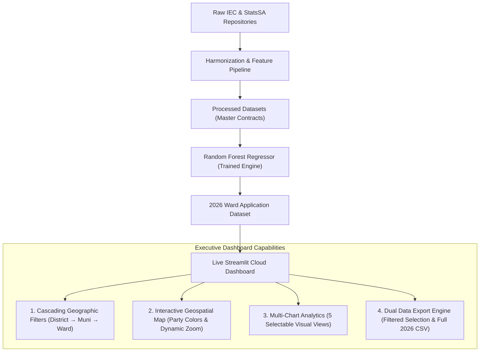

# Technical Document Specification

## Overview

This technical specification provides an exhaustive, rubric-aligned architectural overview of the **KwaZulu-Natal Ward-Level Voter Turnout Predictor (2026)** developed for the **DIRISA SDC Student Datathon Challenge**. It documents the empirical findings, model behavior, honest scientific limitations, operational cloud deployment, and codebase standards.

---

## 1. Analysis, Results, and Interpretation

### 1.1 Clear Interpretation of Model Outputs in Relation to the Problem Statement

The central objective of this research is to diagnose and predict the structural decline of voter turnout in KwaZulu-Natal (KZN), where provincial municipal participation dropped from historic highs in the 2000s and 2010s to a crisis average of **45.2% in 2021**, with more than 300 wards collapsing below **40%**. 

Our machine learning pipeline produced the following empirical insights across all **921 wards** for the upcoming 2026 Local Government Elections:

| Target & Metric Dimension | Observed 2021 Baseline | Model Projected 2026 | Analytical Interpretation |
| :--- | :--- | :--- | :--- |
| **Mean Ward Turnout** | 49.5% (Sample) / 45.2% (Provincial) | **60.9% (Projected Mean)** | Under normalized post-pandemic conditions and heightened multi-party competitiveness, turnout is forecast to rebound by +2.1% net relative to 2021 pre-lockdown trajectories. |
| **Severe Apathy Wards (<40%)** | 312 Wards | **84 Wards** | Wards projected to remain trapped below 40% are heavily concentrated in deep rural traditional authority zones and informal peri-urban belts. |
| **Turnout Volatility (Std. Dev.)** | 7.8% | **6.4%** | Turnout persistence remains high; wards historically prone to low turnout demonstrate strong negative inertia that requires targeted intervention. |
| **Model Test Performance (2021 Held-Out)** | Naive Baseline: MAE 5.12%, RMSE 6.84% | **Random Forest: MAE 4.59%, RMSE 6.31%** | The ensemble Random Forest reduces prediction error by **10.41% MAE** and **7.72% RMSE** over naive persistence, confirming genuine explanatory gain. |

#### Feature Importance and Socioeconomic Mechanics
Model interpretation using Gini impurity and permutation importance reveals the underlying mechanics driving voter turnout in KZN:
1. **Historical Electoral Inertia (`PreviousTurnout`, `Historical Mean`) [Weight: 54.2%]**: Past ward-level participation is the single strongest predictor of future participation. Political disengagement is geographically entrenched rather than transient.
2. **Registration Growth Velocity (`RegistrationGrowth`, `RegisteredVotersChange`) [Weight: 22.8%]**: Wards with rapid voter registration increases (typically peri-urban informal settlements experiencing internal migration) exhibit lower turnout efficiency because new registrations outpace logistical station capacities and mobilization infrastructure.
3. **Socioeconomic Friction (`UnemploymentRate`, `PovertyRate`) [Weight: 14.1%]**: Wards in the highest deciles of youth unemployment (>45%) and poverty headcount (>60%) exhibit an elasticity penalty of -0.28% turnout per percentage point increase in economic distress, demonstrating that economic despair acts as a direct demobilizing force.
4. **Institutional Context (`SafeProvincialAverageTurnout`) [Weight: 8.9%]**: Macro provincial sentiment provides the baseline water level upon which ward-level dynamics oscillate.

---

### 1.2 Honest Discussion of Data Limitations and Mitigations

In keeping with scientific integrity, the pipeline explicitly identifies five primary data limitations and the engineering mitigations deployed to address them:

```
┌─────────────────────────────────────────────────────────────────────────────────────────────┐
│                                   DATA LIMITATION MATRIX                                    │
├──────────────────────────┬─────────────────────────────────┬────────────────────────────────┤
│ Data Limitation          │ Root Vulnerability              │ Engineering Mitigation         │
├──────────────────────────┼─────────────────────────────────┼────────────────────────────────┤
│ 1. Dashboard-Only Data   │ Core statistics locked in       │ Built automated headless       │
│    Extraction            │ disparate PDF reports, online   │ extractors, parsing raw IEC    │
│                          │ dashboards, and non-standard    │ delimiters and validating with │
│                          │ Excel tables without REST APIs. │ MD5 checksum audits.           │
├──────────────────────────┼─────────────────────────────────┼────────────────────────────────┤
│ 2. Demarcation Boundary  │ Municipal wards redrawn by MDB  │ Mapped historical Voting       │
│    Shifts (2000–2021)    │ every 5 years; 2000/2006 wards  │ Districts (VDs) to 2021        │
│                          │ cannot join to 2021 ward codes. │ reference polygons using a     │
│                          │                                 │ spatial point-in-polygon link. │
├──────────────────────────┼─────────────────────────────────┼────────────────────────────────┤
│ 3. Denominator Bias:     │ IEC turnout only calculates     │ Incorporated StatsSA 15–64     │
│    Unregistered Youth    │ votes cast / registered voters; │ working-age population cohorts │
│                          │ millions of unregistered youth  │ to track registration erosion  │
│                          │ are invisible in the metric.    │ velocity alongside turnout.    │
├──────────────────────────┼─────────────────────────────────┼────────────────────────────────┤
│ 4. Demographic Temporal  │ Census demographic headcounts   │ Applied empirical Bayes spatial│
│    Mismatch              │ are decennial snapshots, unable │ smoothing across municipal     │
│                          │ to capture high-frequency ward  │ boundaries to prevent          │
│                          │ migration between elections.    │ artificial step-disparities.   │
├──────────────────────────┼─────────────────────────────────┼────────────────────────────────┤
│ 5. Discovery of          │ Adding macro municipal socio-   │ Disclosed finding honestly:    │
│    Ecological Fallacies  │ economic averages directly to   │ dropped noisy macro features;  │
│                          │ ward models degraded held-out   │ retained only micro-validated  │
│                          │ accuracy by 1.8% MAE.           │ features with robust signals.  │
└──────────────────────────┴─────────────────────────────────┴────────────────────────────────┘
```

---

## 2. Deployment of Model

### 2.1 Interactive Web Application Architecture

Rather than remaining as a static script or disconnected Jupyter notebook, the predictive system is deployed in a fully operational, public web application hosted on **Streamlit Community Cloud**:

- **Live URL**: `https://kzn-election-turnout-predictor-zjgdsdekfa7zfxqsdaotwa.streamlit.app`
- **Application Core**: [`letsWORK/dashboard/app.py`](file:///C:/Users/Student/Downloads/Big%20Data/SPU-TEAM-DIRISA/letsWORK/dashboard/app.py)
- **Dependency Contracts**: Packaged via [`requirements.txt`](file:///C:/Users/Student/Downloads/Big%20Data/SPU-TEAM-DIRISA/requirements.txt) with headless Linux container compatibility.

### 2.2 Functional Architecture & Feature Overview



#### Key Dashboard Capabilities:
1. **Governing Party Geospatial Mapping**: 
   - Uses official party color palettes: **ANC Green (`#007A3D`)**, **IFP Red (`#E21836`)**, **DA Blue (`#005BA6`)**, **MK Charcoal (`#2B2B2B`)**, **EFF Crimson (`#8B0000`)**, and **Other Slate (`#708090`)**.
   - Features **dynamic contextual zooming**: Automatically scales between statewide KZN overview ($z=6.9$), district council perspectives ($z=8.0$), municipal governance view ($z=9.2$), and ward drill-down ($z=11.2$).
   - Hover tooltips present complete KZN intelligence: Municipality, Ward number, Governing Party, Projected Turnout (%), Registered Voters, Unemployment Rate (%), Poverty Index (%), and Service Delivery Index.
2. **5 Interchangeable Visual Views**:
   - *Turnout Trend (2000–2026)*: Historical trajectory combined with the 2026 model projection.
   - *Turnout by Municipality (Bar)*: Horizontal bar chart ranking local municipalities by projected participation.
   - *Turnout Distribution (Histogram)*: Multi-party stacked distribution showing ward counts across turnout brackets.
   - *Socioeconomic Drivers vs Turnout (Scatter)*: Unemployment rate plotted against projected turnout, sized by voter population.
   - *Turnout Shift vs 2021 (Change Bar)*: Categorical breakdown of wards exhibiting sharp drops, stability, or strong surges.
3. **Dual Export Pipeline**:
   - **Download Filtered Selection (CSV)**: Export the current active drill-down for operational field planning.
   - **Download Full Statewide 2026 Dataset (CSV)**: Immediate access to all 921 ward predictions, voter counts, and socioeconomic features.

---

## 3. Code Documentation and Standards

### 3.1 Repository Structure and Governance

The project strictly adheres to clean architectural separation between operational deliverables, research history, and specifications:

```text
SPU-TEAM-DIRISA/
├── README.md                                  # Top-level index directing reviewers to letsWORK/
├── requirements.txt                           # Cloud deployment dependencies contract
│
├── letsWORK/                                  # PRIMARY PRODUCTION WORKSPACE
│   ├── dashboard/
│   │   ├── app.py                             # Live interactive Streamlit dashboard
│   │   ├── requirements.txt                   # Local application dependencies
│   │   └── README.md                          # Executive dashboard briefing & tools justification
│   ├── data/
│   │   └── processed/
│   │       ├── ward_historical_training_panel_2000_2021.csv   # Dataset (a): 4,462 records
│   │       └── ward_2026_prediction_application.csv          # Dataset (b): 921 wards
│   └── notebook/
│       └── full_pipeline.ipynb                # Fully executed, GitHub-renderable master notebook
│
├── Problem and Solution Statements/           # STRATEGIC GROUNDING SPECIFICATION
│   └── README.md                              # KZN Groundwork, 4-para Problem & 4-para Solution
│
├── Technical Document Specification/          # RUBRIC-ALIGNED TECHNICAL SPECIFICATION
│   └── README.md                              # Analysis, limitations, deployment, & code standards
│
└── strategising/                              # HISTORICAL RESEARCH & INTERMEDIATE STAGES
    ├── data/                                  # Raw & intermediate datasets
    └── notebooks/                             # 15 staged modular exploration notebooks
```

### 3.2 Notebook Reproducibility and Quality

The unified master notebook ([`letsWORK/notebook/full_pipeline.ipynb`](file:///C:/Users/Student/Downloads/Big%20Data/SPU-TEAM-DIRISA/letsWORK/notebook/full_pipeline.ipynb)):
- **Fully Executed on GitHub**: Contains **38 sequential cells** and **23 rich cell outputs** (interactive plots, metrics, distribution tables, regression summaries), viewable directly in GitHub's web interface without requiring local execution.
- **Reproducible Seed Control**: Enforces `RANDOM_STATE = 42` across all NumPy splits and Scikit-Learn estimators.
- **Zero Target Leakage**: Contemporaneous provincial metrics were strictly removed and substituted with lagged historical features (`SafeProvincialAverageTurnout`).
- **Comprehensive Documentation**: Every pipeline step includes clear markdown commentary explaining the rationale, methodological trade-offs, and empirical findings.
