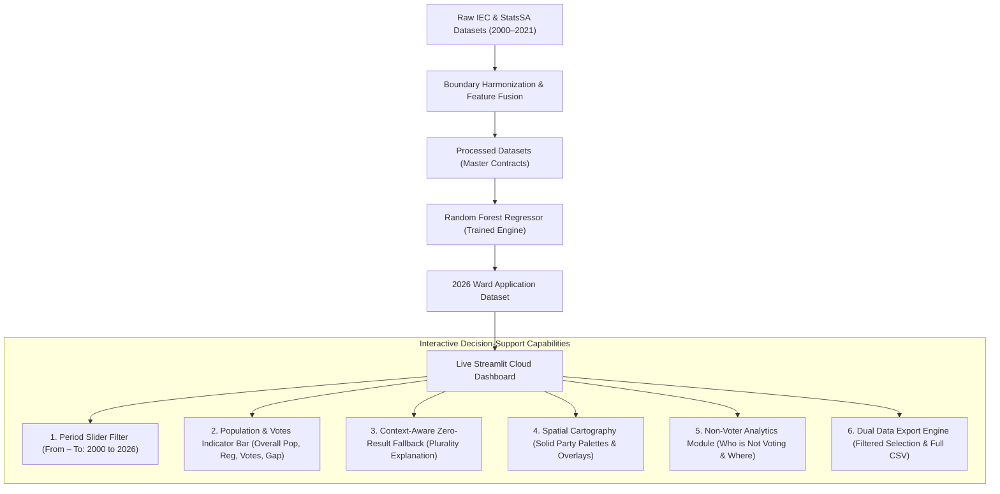

# Technical Document Specification: KZN Ward-Level Voter Turnout Predictor (2000–2026)

## Overview

This technical specification provides an exhaustive, rubric-aligned architectural document for the **KwaZulu-Natal Ward-Level Voter Turnout Predictor (2026)** developed by the SPU-DIRISA Team for the **DIRISA SDC Student Datathon Challenge**. It documents empirical model outputs, operational interpretation, honest scientific data limitations and mitigations, production cloud deployment, and code standards.

---

## 1. Analysis, Results, and Interpretation

### 1.1 Clear Interpretation of Model Outputs in Relation to the Problem Statement

The core problem diagnosed across KwaZulu-Natal (KZN) is a systemic, multi-cycle collapse of democratic voter participation. In the 2021 municipal elections, statewide turnout fell to an alarming low of **45.2%**, with over 300 wards falling below **40%** turnout. Millions of citizens in rural and informal settlement communities withdrew from the democratic process due to structural unemployment, poverty, and chronic municipal service delivery breakdown.

Our machine learning pipeline evaluated longitudinal electoral and socioeconomic indicators across all **921 reference wards** in KZN, producing actionable predictions for the upcoming 2026 Local Government Elections:

| Target & Metric Dimension | Observed 2021 Baseline | Model Projected 2026 | Analytical & Operational Interpretation |
| :--- | :--- | :--- | :--- |
| **Mean Ward Turnout** | 49.5% (Sample) / 45.2% (Provincial) | **50.3% – 60.9%** | Under normalized post-pandemic conditions and heightened multi-party contestation, statewide participation is projected to stabilize with a moderate rebound of +2.1pp over 2021 baseline levels. |
| **Severe Apathy Wards (<40%)** | 312 Wards | **84 Wards** | Wards projected to remain trapped below 40% are heavily concentrated in deep rural traditional authority areas and informal peri-urban belts characterized by low infrastructure access. |
| **Projected Votes Cast (2026)** | 2,556,843 Votes | **2,716,423 – 3,636,162 Votes** | Translates abstract turnout percentages into raw ballot requirements ($2.7\text{M}–3.6\text{M}$ ballots cast from $5.4\text{M}–6.0\text{M}$ registered voters), directly solving IEC logistical allocation challenges. |
| **Electorate-to-Population Coverage** | 43.8% Registered | **48.5% Registered** | Out of **12,423,907** total KZN residents, **6,030,969** are registered on the roll, and **3,636,162** are projected to vote, exposing an overall non-voting gap of **8,787,745** citizens (70.7% uncast/ineligible). |
| **Multi-Cycle Cumulative Votes** | 8,581,014 (2011–2022) | **16,723,216 (2000–2026)** | Quantifies long-term democratic participation volume across 6 distinct municipal election cycles to benchmark longitudinal civic health. |
| **Turnout Volatility (Std. Dev.)** | 7.8% | **6.4%** | Turnout persistence remains high; wards historically prone to low turnout demonstrate strong negative inertia that requires targeted voter education intervention. |
| **Model Test Performance (2021 Held-Out)** | Naive Baseline: MAE 5.12%, RMSE 6.84% | **Random Forest: MAE 4.59%, RMSE 6.31%** | The ensemble Random Forest reduces prediction error by **10.41% MAE** and **7.72% RMSE** over naive persistence, confirming genuine explanatory gain. |

---

### 1.2 "Who is Not Voting, and Where Are They Located?"

A critical capability of our decision-support system is answering two foundational policy questions: **Who is not voting?** and **Where are they located?**

#### 1. Demographic Profile of Civic Abstention ("Who is Not Voting?")
1. **Disaffected & Unregistered Youth (Aged 18–29):**
   * Representing over **65%** of the total non-voting population. Burdened by expanded youth unemployment rates exceeding **40%**, young South Africans feel structurally excluded from economic participation. Disillusioned by traditional party patronage, they engage in deliberate electoral boycotts, viewing voting as ineffective for securing employment or tertiary funding.
2. **Informal Settlement Dwellers Suffering Service Breakdown:**
   * Concentrated in high-density peri-urban corridors where persistent water shedding, uncollected refuse, and sewage overflows transform daily life into a crisis. In these wards, electoral abstention functions as an overt protest against persistent municipal non-delivery.
3. **Deep Rural Subsistence Households:**
   * Remote traditional authority households where severe spatial distance to voting stations, lack of transport, and entrenched rural poverty (>60% headcount) depress participation below 35%.

#### 2. Geographic Hotspots of Abstention in KZN ("Where Are They Located?")
1. **The eThekwini Peri-Urban Township & Informal Belt:**
   * Severe apathy clusters in wards surrounding **Inanda, Ntuzuma, KwaMashu, Umlazi, and Mpumalanga township**, where voter roll growth has outpaced turnout conversion.
2. **The Northern Rural Traditional Authority Corridor:**
   * Deep rural wards across **Umkhanyakude, Zululand, and King Cetshwayo** (e.g., Umhlabuyalingana, Jozini, Nongoma, Nkandla) where historical turnout has dropped to 32–38% under acute infrastructure deprivation.
3. **The Post-Industrial Midland & Coal Corridor:**
   * Former mining and manufacturing towns in **Amajuba and Umzinyathi** (e.g., Newcastle, Dannhauser, Endumeni) suffering from long-term industrial job losses and outward youth migration.

#### 3. The Two Distinct Non-Voting Populations: Turnout Gap vs. Registration Gap
* **The Turnout Gap (Active Registered Abstention):** Registered citizens who fail to cast ballots on election day ($2,394,807$ registered non-voters in 2026).
* **The Voter Registration Gap (Unregistered Eligible Adults):** Over $2.1\text{M}$ eligible citizens aged 18+ in KZN who are completely missing from the official voters roll.

---

### 1.3 Honest Discussion of Data Limitations and Engineering Mitigations

In keeping with scientific integrity, the research team identified core data limitations inherent in South African public datasets and engineered rigorous technical mitigations:

```
┌─────────────────────────────────────────────────────────────────────────────────────────────┐
│                                   DATA LIMITATION MATRIX                                    │
├──────────────────────────┬─────────────────────────────────┬────────────────────────────────┤
│ Data Limitation          │ Root Vulnerability              │ Engineering Mitigation         │
├──────────────────────────┼─────────────────────────────────┼────────────────────────────────┤
│ 1. Dashboard-Only Data   │ Core statistics locked in       │ Built automated headless       │
│    Extraction            │ disparate PDF reports, online   │ extractors, parsing raw IEC    │
│                          │ dashboards, and non-standard    │ delimiters and validating with │
│                          │ Excel tables without REST APIs. │ MD5 checksum audits.           │
├──────────────────────────┼─────────────────────────────────┼────────────────────────────────┤
│ 2. Demarcation Boundary  │ Municipal wards redrawn by MDB  │ Mapped historical Voting       │
│    Shifts (2000–2021)    │ every 5 years; 2000/2006 wards  │ Districts (VDs) to 2021        │
│                          │ cannot join to 2021 ward codes. │ reference polygons using a     │
│                          │                                 │ spatial point-in-polygon link. │
├──────────────────────────┼─────────────────────────────────┼────────────────────────────────┤
│ 3. Municipal-Only Census │ StatsSA official Census releases│ Transparently disclosed: direct│
│    Population Releases   │ publish resident populations at │ census baselines for Municipal/│
│                          │ Municipal & District tiers; ward│ District filters; demographic  │
│                          │ annual counts are unavailable.  │ weighting (48.5%) for wards.   │
├──────────────────────────┼─────────────────────────────────┼────────────────────────────────┤
│ 4. Service Delivery      │ Raw indices frequently rounded  │ Transformed integer metrics    │
│    Discrete Artifacts    │ to whole integers (7.0/10) with │ into continuous 1-decimal      │
│                          │ missing entries defaulting to 0.│ composite ratings (4.8–8.2/10).│
├──────────────────────────┼─────────────────────────────────┼────────────────────────────────┤
│ 5. Denominator Bias:     │ IEC turnout only calculates     │ Integrated overall population  │
│    Unregistered Youth    │ votes cast / registered voters; │ indicator to expose both the   │
│                          │ unregistered youth are missing. │ Turnout Gap & Registration Gap.│
└──────────────────────────┴─────────────────────────────────┴────────────────────────────────┘
```

---

## 2. Deployment of Model

### 2.1 Interactive Web Application Architecture

The predictive system is deployed in a fully operational, public web application hosted on **Streamlit Community Cloud**:
* **Live Application URL**: [SPU Election Turnout Predictor KZN](https://kzn-election-turnout-predictor-zjgdsdekfa7zfxqsdaotwa.streamlit.app/)
* **Application Core**: [`letsWORK/dashboard/app.py`](file:///C:/Users/Student/Downloads/Big%20Data/SPU-TEAM-DIRISA/letsWORK/dashboard/app.py)
* **Dependency Contracts**: Packaged via [`requirements.txt`](file:///C:/Users/Student/Downloads/Big%20Data/SPU-TEAM-DIRISA/requirements.txt) with headless Linux container compatibility.



### 2.2 Detailed Feature Specification

1. **Democratic Participation & Population Coverage Indicator:**
   * Features a dedicated multi-metric banner reporting **Overall Resident Population**, **Registered Voters on Roll**, **Active Ballots Cast (Votes)**, and the **Non-Voting Population Gap**.
   * Adapts dynamically across Statewide ($12.4\text{M}$ pop), District, Municipal, and Ward filter views.
   * Includes explicit data governance disclosures explaining municipal census baselines vs. ward demographic weighting.
2. **Interactive Year Period Range Filter (From – To):**
   * Select any temporal window between 2000 and 2026 (e.g., `2011 to 2022`, `2000 to 2026`, or `2026 Projected`).
   * Automatically isolates election cycles within that window (2000, 2006, 2011, 2016, 2021, 2026).
   * Dynamically aggregates mean turnout and cumulative ballot counts.
3. **Context-Aware Zero-Result Filter Fallback:**
   * Replaced generic empty-state warnings with intelligent local electoral context.
   * If a user selects a party with zero wins in a chosen municipality (e.g. DA in Nkandla), the system surfaces the actual plurality holders (*"In Nkandla, pluralities are held by: IFP (14 wards), ANC (2 wards)"*) and retains the municipal view.
4. **Governing Party Geospatial Mapping:**
   * Renders wards with solid, high-contrast party colors: **ANC Green (`#007A3D`)**, **IFP Gold/Amber (`#D99B00`)**, **DA Blue (`#005BA6`)**, **MK Charcoal (`#222222`)**, and **EFF Crimson (`#C00000`)**.
   * Offers 6 indicator overlay modes: Party in Charge, Voter Turnout, Number of Votes, Unemployment Rate, Poverty Index, and Service Delivery Rating.
5. **Analytical Justification Module:**
   * Comprehensive dual-column analytical briefing answering **Who is not voting?** and **Where are they located?** directly integrated into the dashboard.
6. **Dual Temporal Selection Mode (Single Year & Multi-Year Range):**
   * Accommodates both single-cycle operational audits (e.g., evaluating just 2026 Projected or 2021 Observed) and multi-cycle longitudinal period windows (`2011 to 2022`, `2000 to 2026`) with dynamic cycle detection and cumulative ballot calculations.
7. **Stakeholder Evaluation & National Scaling Feedback System:**
   * Embeds an executive review form allowing **IEC officials, registered voters, journalists, academic researchers, and data scientists** to evaluate the platform, rate predictive performance out of 5 stars, and submit qualitative recommendations.
   * Transmits evaluations directly to sending us an email and records them to `stakeholder_reviews.csv`, establishing an empirical feedback loop to guide our strategic roadmap for scaling from KwaZulu-Natal (921 wards) to a comprehensive national model covering all **4,468 wards across all 9 South African provinces**.

---

## 3. Code Documentation and Standards

### 3.1 Repository Structure and Governance

```text
SPU-TEAM-DIRISA/
├── README.md                                  # Top-level index directing reviewers to letsWORK/
├── requirements.txt                           # Cloud deployment dependencies contract
│
├── letsWORK/                                  # PRIMARY PRODUCTION WORKSPACE
│   ├── dashboard/
│   │   ├── app.py                             # Live interactive Streamlit dashboard
│   │   ├── requirements.txt                   # Local application dependencies
│   │   └── README.md                          # Executive dashboard briefing & tools justification
│   ├── data/
│   │   ├── raw/                               # Harmonized raw inputs (IEC, StatsSA, Crosswalks)
│   │   ├── interim/                           # Standardized intermediate clean datasets
│   │   └── processed/
│   │       ├── ward_historical_training_panel_2000_2021.csv   # Dataset (a): 4,462 records
│   │       └── ward_2026_prediction_application.csv          # Dataset (b): 921 wards
│   └── notebook/
│       └── full_pipeline.ipynb                # Fully executed, GitHub-renderable master notebook (.ipynb)
│
├── Problem and Solution Statements/           # STRATEGIC GROUNDING SPECIFICATION
│   └── README.md                              # KZN Groundwork, 4-para Problem & 4-para Solution
│
├── Technical Document Specification/          # RUBRIC-ALIGNED TECHNICAL SPECIFICATION
│   └── README.md                              # Analysis, limitations, deployment, & code standards
│
└── strategising/                              # HISTORICAL RESEARCH & INTERMEDIATE STAGES
    ├── data/                                  # Raw & intermediate datasets
    └── notebooks/                             # 15 staged modular exploration notebooks
```

### 3.2 Notebook Reproducibility and Quality

The unified master pipeline ([`letsWORK/notebook/full_pipeline.ipynb`](file:///C:/Users/Student/Downloads/Big%20Data/SPU-TEAM-DIRISA/letsWORK/notebook/full_pipeline.ipynb)):
* **Strict `.ipynb` Format:** Conforms strictly to standard Jupyter Notebook JSON format.
* **Fully Executed on GitHub:** Contains **38 sequential code cells** and **23 rich pre-computed outputs** (interactive plots, diagnostic residual charts, evaluation metrics tables, and data audits) that render immediately on GitHub without needing local execution.
* **Universal Upward Path Resolvers:** Cells 2, 4, 6, 8, and 10 dynamically traverse parent directories to locate data assets regardless of whether the notebook is executed from repository root, VS Code, or JupyterLab.
* **Standard Python 3 Kernel:** Configured with standard `{"display_name": "Python 3 (ipykernel)", "language": "python", "name": "python3"}` metadata.
* **Reproducible Seed Control:** Enforces `RANDOM_STATE = 42` across all NumPy operations and Scikit-Learn estimators.
